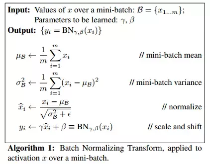

## Algorithm ##

Batch Normalization (BN) has 
* non-learnable parameters:  
  1. mean_batch $\mu_{B}$ 
  2. variance_batch $\sigma_{B}$
  3. running_mean $\mu_{run}$
  4. running_variance $\sigma_{run}$
* learnable parameters (not fix during training):
  1. weight $\gamma$
  2. bias $\beta$

A random sample $i$ in a mini-batch is denoted by $x_i$ and epsilon $\epsilon$ prevents zero division. Additionally, decaying coefficient is indicated by $\alpha$, typically 0.99.
BN has different behaviors during training and inference.  
* Training:
  1. Normalized sample $\hat{x}_i$ 
   $$\hat{x}_{i} = \frac{x_{i} - \mu_{B}}{\sqrt{\sigma_{B}^2 + \epsilon}}$$
  2. Scaled and shifted sample $\hat{y}_i$ 
   $$\hat{y}_i = \gamma \hat{x} + \beta$$
  3. weight $\gamma$ and bias $\beta$ 
   They're optimized by optimizer.
  4. (not always needed) running_mean $\mu_{run}$ and running_variance $\sigma_{run}$ 
   $$\mu_{run}^{new} = \alpha * \mu_{run}^{old} + (1-\alpha) * \mu_{B} $$ 
    $$\sigma_{run}^{new} = \alpha * \sigma_{run}^{old} + (1-\alpha) * \sigma_{B} $$ 
   $\mu_{run}$ and $\sigma_{run}$ are set up to record mean and variance of the whole training set, moving average, i.e. momentum is used.
   
* Inference:
  1. Learnable parameters $\gamma$ and $\beta$ are fixed
  2. Statistics of non-learnable parameters $\mu_{B}$ and $\sigma_{B}$ varies with different batch sizes. Two methods to retain robustness: 
      * When inference batch size is identical to the training batch size, and iteration is possible. We could iterate over the whole test set and calculate mean and variance for each BN layer. Use these mean and variance for all samples of all batches.
      * When inference batch size is identical to the training batch size, use $\mu_{B}$ and $\sigma_{B}$ of each test batch. 
      *  When inference batch size is much smaller than the training batch size, for example, batch size = 1/2, $\mu_{B}$ and $\sigma_{B}$ don't make sense. Use $\mu_{run}$ and $\sigma_{run}$ instead.
  3. Normalized sample $\hat{x}_i$ 
   $$\hat{x}_i = \frac{x_i - \mu_{B}}{\sqrt{\sigma_{B}^2 + \epsilon}}$$
  4. Scaled and shifted sample $\hat{y}_i$ 
   $$\hat{y}_i = \gamma \hat{x} + \beta$$ 

## Code ##
[https://github.com/Erlemar/cs231n_self/blob/master/assignment2/cs231n/layers.py#L116](https://github.com/Erlemar/cs231n_self/blob/master/assignment2/cs231n/layers.py#L116)

## Pros and Non-applicable Scenarios ##
Pros of BN:
* Reduction of Internal Covariance Shift (ICS) and acceleration of convergence. Weights updating leads to distributional shift of output of the bottom layers. Top layers have to follow the bottom layers.
* Robustness to initial weights and hyperparameters.
* Better generalization

BN is not applicable when training batch size is very small, $\mu_{B}$ and $\sigma_{B}$ aren't reasonable, i.e., $x_i - \mu_{B} = 0$. Specific non-applicable sennarios:
* Fine-tuning
* Distributive training (different samples to different instances)
* RNN
* Online learning

Alternative normalization:
* Layer norm
* Instance norm
* Group norm (+weight standardization)
* Synchronous Batch norm

## Reference ##
1. [Batch Normalization: Accelerating Deep Network Training by Reducing Internal Covariate Shift](https://arxiv.org/abs/1502.03167)
2. https://www.quora.com/How-does-batch-normalization-behave-differently-at-training-time-and-test-time
3. https://towardsdatascience.com/curse-of-batch-normalization-8e6dd20bc304
   

